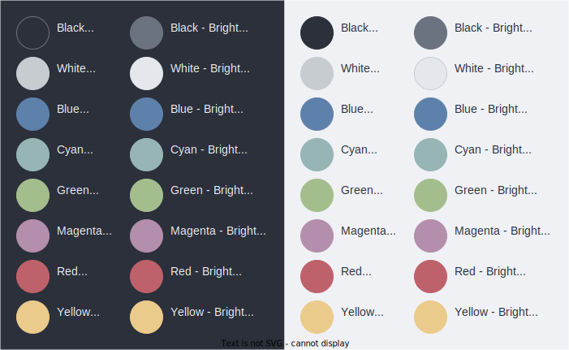

= Ocean theme for VS Code

== Palette

[Attributes]
|===
|Hex |Name |Use cases (light theme)

|#2b303b
|Black
|Chrome background, text

|#6b7280
|Black Bold
|Chrome highlights, light text

|#c7ccd1
|White
|Borders, rules, active item

|#e4e7eb
|White Bold
|Backgrounds for panels, etc.

|#f2f4f8
|Pure White
|Editor area background

|#5e81ac
|Blue
|Info, modifications, focus, links, search/find

|#96b5b4
|Cyan
|Selection

|#a3be8c
|Green
|Success, additions

|#b48ead
|Magenta
|Deletions

|#bf616a
|Red
|Errors

|#ebcb8b
|Yellow
|Warnings, debugging, highlights
|===
