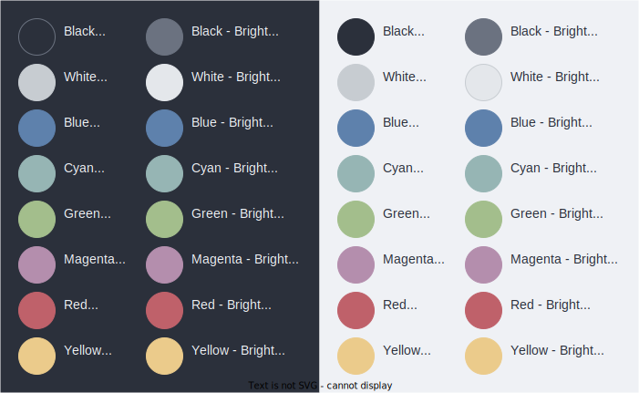

= Color palette

:link-terminal-color-generator: https://glitchbone.github.io/vscode-base16-term/#/ocean

The Ocean theme is built on the following base16 color palette, which is a
modification of the "Ocean" terminal theme in Adrien Glitchbone's
{link-terminal-color-generator}[base16 terminal color scales generator]
for VS Code.

